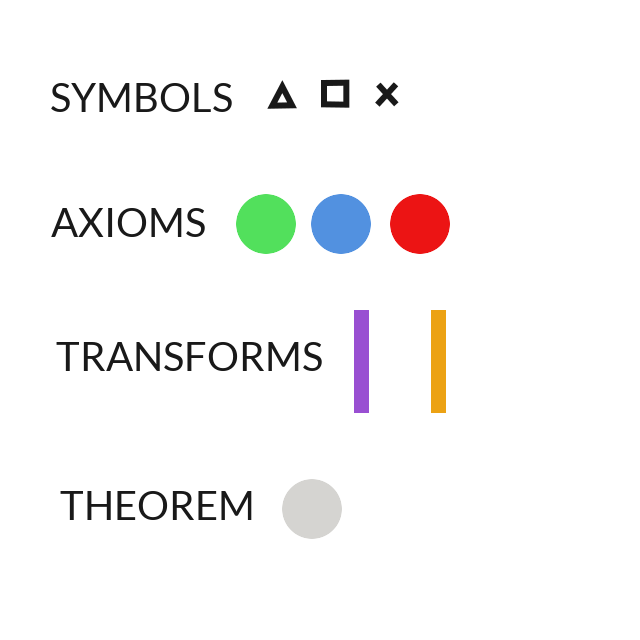

## Gödel's Proof

[This book](http://www.goodreads.com/book/show/695429.G_del_s_Proof) explores a
realization that I haven't fully comprehended yet.

I believe it is saying that mathematical proofs exist only as graphs in some
abstract space of meaningless symbols. The act of interpreting such a proof
requires assigning the symbols some meaning, obviously.

The struggle is that the symbolic graphs we construct to explain facts become
logical beasts of their own, prone to generating sentences paradoxical under
our desired interpretation.

Of course, the proofs are first constructed in the context of meaning, but the
entire process seems to be a struggle to context-switch between the realms of
meaning and symbology, which do not necessarily mirror one another.

It seems that the constructing proofs in the realm of symbols, motivated by
thoughts and intuitions in the realm of meaning, is a way to harden or
discredit our intuitions.

But Godel has somehow proved that symbols cannot always provide both a
consistent and complete system of meaning.  And that is a very good example of
the fallibility of our intuition.

